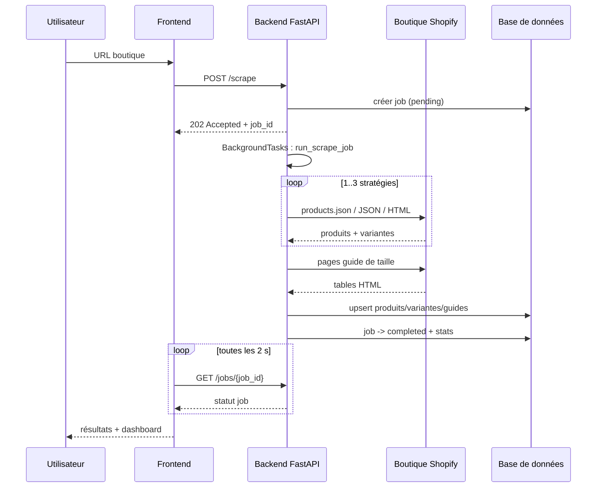
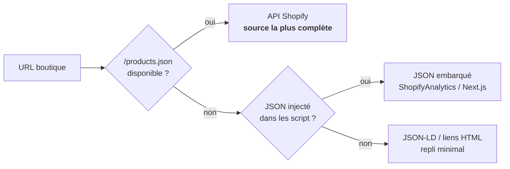

# Architecture du projet

Document d'architecture pour la présentation : vue d'ensemble, flux de
données, couches du backend, moteur de scraping et choix techniques.

Les diagrammes Mermaid correspondants sont dans [`docs/architecture.mmd`](docs/architecture.mmd)
(à coller dans un outil compatible : GitHub, Mermaid Live, slides...).

---

## 1. Vue d'ensemble

```
┌─────────────┐      HTTPS      ┌──────────────┐      SQL      ┌─────────────┐
│  Frontend   │ ───────────────▶│   Backend    │ ─────────────▶│   Base de   │
│  Next.js 15 │                 │   FastAPI    │               │  données    │
│ (Cloudflare │ ◀───────────────│   (Render)   │ ◀─────────────│ PostgreSQL  │
│   Workers)  │      JSON       │              │               │   (Neon)    │
└─────────────┘                 └──────┬───────┘               └─────────────┘
                                       │  requêtes HTTP + retries
                                       ▼
                              ┌──────────────────┐
                              │  Boutiques Shopify│
                              └──────────────────┘
```

Trois couches indépendantes, échangeant uniquement via des contrats stables
(API REST / JSON et schéma de base de données) :

| Composant | Techno | Déploiement | Rôle |
|---|---|---|---|
| **Frontend** | Next.js 15 (React, TypeScript) | Cloudflare Workers (OpenNext) | pilotage : lancer un scraping, consulter le catalogue, exporter |
| **Backend** | FastAPI + Uvicorn (Python 3.12) | Render | moteur de scraping, API REST, persistance |
| **Base de données** | PostgreSQL (SQLAlchemy 2.x) | Neon (production) / SQLite (local) | stockage des boutiques, produits, variantes, guides, jobs |

---

## 2. Flux d'un scraping (comment ça marche)



1. **`POST /scrape`** répond immédiatement `202 Accepted` avec un `job_id` :
   l'exécution est **asynchrone** (FastAPI `BackgroundTasks`), l'utilisateur
   n'attend pas pendant le réseau.
2. Le moteur de scraping **interroge la boutique** (stratégies en cascade,
   voir §4), puis **écrit le résultat en base** (upsert par handle).
3. Le statut du job suit un cycle de vie `pending → running → completed |
   failed`, avec les statistiques écrites (nb produits / variantes / guides).
4. Le frontend **interroge `GET /jobs/{id}` toutes les 2 s** (React Query +
   polling) et affiche la progression, puis les résultats.

---

## 3. Backend — architecture en couches

```mermaid
flowchart TD
    subgraph API[ Couche API - FastAPI ]
        R1[POST /scrape]
        R2[GET /jobs/&#123;id&#125;]
        R3[GET /products]
        R4[GET /size-guides]
        R5[GET /export/*]
    end
    subgraph SRV[ Couche Services ]
        S1[ScrapeService<br/>cycle de vie jobs]
        S2[CatalogService<br/>requêtes catalogue]
        S3[ExportService<br/>génération exports]
    end
    subgraph REPO[ Couche Repositories ]
        D1[JobRepository]
        D2[CatalogRepository<br/>upsert produits]
        D3[WebsiteRepository]
    end
    subgraph DB[ Couche données ]
        MOD[(Modèles SQLAlchemy<br/>Website / Product / Variant<br/>SizeGuide / ScrapeJob)]
    end
    API --> SRV --> REPO --> MOD
```



- **Routes (schemas Pydantic)** : validation des entrées, contrats de réponse
  typés, contraintes SQL safe (tri whitelisté, pagination bornée).
- **Services** : logique métier (cycle de vie des jobs, catalogue, exports),
  indépendante du framework HTTP.
- **Repositories** : uniquement l'accès SQL (pagination, recherche `ILIKE`,
  upsert `(website_id, handle)`), ce qui isole le SQL du reste.
- **Modèles SQLAlchemy 2.x** : 5 tables avec index et contraintes d'unicité.

Le **moteur de scraping** est branché à part : la couche service le sollicite,
la couche repository **persiste** son résultat (inversion de dépendance).

---

## 4. Moteur de scraping — stratégies d'extraction



Le scraper est **modulaire par stratégies** (protocoles Python `ProductStrategy`
et `SizeGuideStrategy`) : on essaie les sources dans l'ordre, on s'arrête dès
qu'une stratégie rapporte des produits.

| # | Stratégie | Source | Cas d'usage |
|---|-----------|--------|-------------|
| 1 | `shopify_api` | `/products.json?limit=250&page=N` (paginé) | boutiques Shopify classiques : **la plus complète** (variantes, prix, images, options, stock) |
| 2 | `json` | JSON injecté dans les `<script>` (`ShopifyAnalytics.meta.product`, données Next.js, parcours récursif) | thèmes headless / SPA sans API exposée |
| 3 | `html` | JSON-LD schema.org (`@type: Product`), sinon liens `/products/...` | dernier repli, sites peu standard |

**Guides de taille** (stratégie dédiée) :
1. **Détection des URLs candidates** : liens dont le libellé évoque la taille
   (FR/EN : size, sizing, guide, chart, taille, pointure, mesure...) + chemins
   courants (`/pages/size-guide`, `/pages/guide-des-tailles`...).
2. **Extraction** : tables HTML (lignes `tr`, cellules `th/td`) filtrées par
   heuristique (mots-clés taille ou unités de mesure `XS/S/M/L`, `cm`, `in`),
   plus les blocs de texte porteurs de mots-clés.
3. **Qualification** : titre, URL source, texte brut, tables normalisées,
   métadonnées (signaux `table` / `popup` / `accordion` / hook JS), le tout
   dédupliqué.

**Robustesse réseau** (`HttpFetcher`) :
- **User-Agent de navigateur** réaliste (évite le blocage des boutiques) ;
- **retry exponentiel** (tenacity) sur timeout / erreur réseau ;
- gestion des erreurs typées (`FetchError`, `ParseError`) → chaque stratégie
  échoue proprement et la suivante prend le relais.

---

## 5. Frontend — pages

| Page | Contenu |
|---|---|
| **Dashboard** | totaux produits / guides + état du dernier job |
| **Scraper** | formulaire URL (validation zod) + suivi en direct du job (polling 2 s, progression) |
| **Produits** | catalogue paginé, recherche debouncée, tri, fiche détail (variantes) |
| **Guides de taille** | tables normalisées extraites, lien vers la source |
| **Exports** | téléchargement JSON / CSV / XLSX |

Client API unique dans `services/api.ts` (wrapper `fetch` typé, erreurs
explicites) ; données serveur via **React Query** (cache, invalidation,
polling).

---

## 6. Production et CI

- **Backend** : Render (Uvicorn), healthcheck `/ready` (teste la connexion DB),
  variables d'environnement préfixées `SCRAPER_`.
- **Frontend** : Cloudflare Workers via OpenNext — bundle statique + worker ;
  l'URL de l'API est **figée au moment du build** (`NEXT_PUBLIC_API_BASE_URL`).
- **Base** : PostgreSQL Neon (pooler + SSL), SQLite en local pour le dev.
- **CI** : GitHub Actions (lint + tests backend/frontend), Docker Compose
  (`infra/`) pour l'environnement de développement.

---

## 7. Choix techniques (à justifier en présentation)

- **Python exigé** : scraper en Python 3.12 (httpx, BeautifulSoup, tenacity),
  backend FastAPI moderne et typé.
- **Stratégies plutôt qu'un seul scraper** : couvre la diversité des thèmes
  Shopify et reste **extensible** à d'autres CMS (ajout d'un protocole).
- **Async `BackgroundTasks`** : réponse `202` immédiate, l'utilisateur n'est
  pas bloqué pendant les appels réseau (5–10 s par boutique).
- **Upsert par handle** : idempotent, un re-scrap met à jour sans dupliquer.
- **JSON-LD + Next.js data** : stratégies de repli qui résistent aux sites
  sans API publique.
